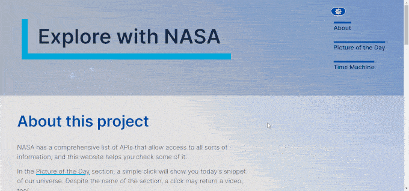

# Explore with Nasa - an API Project

[See website](https://explore-with-nasa.netlify.app/)

## About
A simple website with Next.js used to retrieve [NASA's Astronomy Picture of the Day](https://apod.nasa.gov/apod/astropix.html) from today's entry and from the archive.

The media type information - image or video - is extracted from json to correctly write the appropriate img or iframe tag, so the user will not be limited to images.

## Next steps?
-  [x] Rewrite in React
-  [ ] Change the date picker to a drop-down menu for better accessibility
-  [ ] Implement a search future for retrieval of relevant archive files